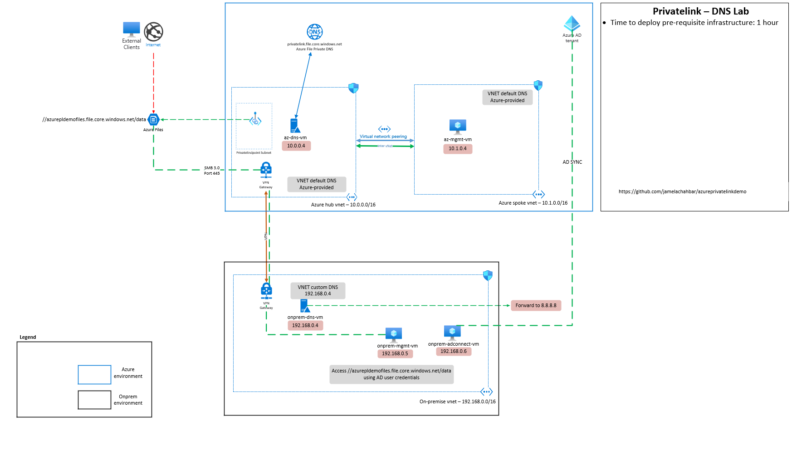

# Azure Private Link Demo

This is a demo showing the usage of private link for Azure Fileshare in an Enterprise Setting.

## Contents

[Demolab introduction and context](#Scenario)

[Challenge 1 : Deploy a Private Endpoint to utilise Azure Private Link for access to Azure Fileshare](#challenge-1--deploy-a-private-endpoint-to-utilise-azure-private-link-for-access-to-azure-fileshare)

[Challenge 2 : Deny public access to Azure File Share](#challenge-2--deny-public-access-to-azure-file-share)

[Challenge 3 : Work with a custom DNS server inside of Azure](#challenge-5--work-with-a-custom-dns-server-inside-of-azure)

[Challenge 4 : Use Private Link to access an Azure Fileshare over a Private Hybrid Connection](#challenge-4--use-private-link-to-access-an-azure-fileshare-over-a-private-hybrid-connection)

[Challenge 5 : (Warning! Stretch Goal / Advanced) Use Private Link from On-Premises without a pre-existing DNS Server in Azure](#challenge-7--warning-stretch-goal--advanced-use-private-link-from-on-premises-without-a-pre-existing-dns-server-in-azure)

[Challenge 6: Part one: enable AD DS authentication for your Azure file shares](#challenge-6--enable-ADDS-authentication-for-your-azure-fileshare)
Part two: assign share-level permissions to an identity
Part three: configure directory and file level permissions over SMB
Part four: mount a file share from a domain-joined VM

## Scenario

Inc. Corporation is a Communications Company. The organisation works within a regulated industry and would like to secure their use of Azure Platform-as-a-service (PaaS) products. As part of their ongoing evaluation of platform features, the IT team has started to look at using **Azure Private Link**.

## Context

This Lab walks through the use of Azure Private Link with a focus on the required changes needed for DNS. Specifically, this builds up to include working with an existing custom DNS infrastructure (I.e. a customer using their own Virtual Machines for Internal DNS Resolution). In this lab we use Microsoft DNS running on top of Microsoft Windows Server 2019.

## Pre-requisites

### Overview

In order to use the Demolab time most effectively, the following tasks should be completed prior to starting the session.
With these pre-requisites in place, we can focus on building the differentiated knowledge in Private Link that is required when working with the product, rather than spending hours repeating relatively simple tasks such as setting up Virtual Networks and Virtual Machines.

At the end of this section your base lab build looks as follows:

### Infrastructure:

Here is a Hybrid architecture built on Microsoft Azure. The Azure Network Architecture is a traditional Hub and Spoke with vnet connectivity using Vnet Peering.
To simulate an onprem environment, I used a vnet called on-premise vnet and added a VPN Gateway to simulate an on-prem VPN device that will connect to an Azure vnet using a S2S VPN link.

### Infrastructure Breakdown

In summary:

- "On-Premises" environment simulated by Azure Virtual Network
- On-Premises contains a management VM (_onprem-mgmt-vm_) and a dns server VM (_onprem-dns-vm_)
- On-Premises is connected to Azure via a Site-to-Site VPN
- Azure contains a simple Hub and Spoke topology, containing a management VM in the spoke (_az-mgmt-vm_) and a dns server VM in the hub (_az-dns-vm_)
- Azure Bastion is deployed in all VNets to enable easy remote desktop access to the Windows VMs
- All of the above is deployed within a single resource group called _azureprivatelink-demo-rg_

### Infrastructure Components

#### AD and DNS

Active Directory is deployed on VM's both on the on-prem vnet and on the Hub vnet.

#### Private Link

I am using Azure Private Link Service to deploy an Azure Private endpoint inside the Hub vnet. This deploys a read-only NIC to be able to reach our fileshare service privately using a private IP address i.s.o. the public ip address.
Because I am leveraging the Hub and Spoke architecture, the spoke vnet can access the fileshare as well. The onprem vnet can access it as well due to the connectivity via VPN Gateway.

#### Authentication

Leveraging Traditional Active Directory authentication and permissions on the Azure fileshares using a combination of scripts and DNS configurations.

# How to deploy the Infrastructure on your environment?

## Using the Deploy to Azure button to deploy via the Portal

https://docs.microsoft.com/en-us/azure/azure-resource-manager/templates/deploy-to-azure-button

## Using Azure Devops Pipeline

Running the pipeline will do the following:

1. Check out the code

2. Build the and test the code base

3. Publish Artifact (ARM template) to build the infrastructure for the 3 stages

4. Deploy to DEV, STG and PRD stage

5. There is a destroy stage (Using pipeline approval). Click on it to review and approve to destroy the whole infrastructure built

### Prerequisite:

- **Azure DevOps account:** we will use an Azure DevOps project with a Github repo and build/release pipelines. Create your free account and a new project [here](https://azure.microsoft.com/services/devops/).

- **Azure Subscription:** An azure subscription is needed to provision the Azure services for this demonstration. If you don’t have one, you can get a free trial one [here](https://azure.microsoft.com/free/). Create an azure DevOps project

- **Bash Shell:** we will leverage Azure Cloud Shell. Once your Azure Subscription is set up you can enable and use your associated [Azure Cloud Shell](https://docs.microsoft.com/azure/cloud-shell/overview) session. Notes: you could use any local bash terminal. Make sure you have [installed the Azure CLI](https://docs.microsoft.com/cli/azure/install-azure-cli)

- **Service Principal:** we will leverage SPN with contributor access to create resources on Azure from Azure DevOps

## Create a resource group in Azure

    #Login to Azure
    az login
    #Set subscription
    az account set --subscription <subscription  id>
    #Create Resource Group
    #az group create --name <rgname> --location <region>
    az group create --name spring-demo --location 'West Europe'

**To create a Service Principal Name**

       #az ad sp create-for-rbac --name <service-principal-name>
       az ad sp create-for-rbac --name SpringSpn

## Create a Build / Continuous Integration (CI) pipeline and continuous delivery (CD)

Create a service connection for the pipeline using the details of the service principal created earlier

**Fill the following details:**

- **Subscription ID:** < Your Subscription ID>
- **Subscription Name:** < subscription name>
- **Service principal id:** < Service principal Id>
- **Service principal Key:** < Service Principal Key>
- **Tenant ID :** < Your Tenant ID>
- **Service Connection Name:** <Service  connection  Name> This will be referenced in the YAML pipeline
- **Click on save and verify**

## :checkered_flag: Results

- You have deployed a basic Azure and On-Premises environment using an ARM Template
- You have become familiar with the components you have deployed in your subscription
- You are now able to login to all VMs using your specified credentials
- End-to-end network connectivity has been verified from On-Premises to Azure

## Create a multi Stage pipeline with Yaml

First fork the [repo](https://github.com/abulina/azureprivatelinkdemo) by clicking on the fork icon on the top right

Navigate to your DevOps project and Create a pipeline by clicking on the Pipeline icon

Click on **New Pipeline** and select **GitHub (YAML)**

Login to Github and authorize it for Azure DevOps. Select the forked repo and it will automatically pick the azure-pipeline.yml file in the repo which contains the YAML template for the build and release stage. Click on **Save and Run** to run the pipeline

**See a complete build and release below:**

# challenge-1--deploy-a-private-endpoint-to-utilise-azure-private-link-for-access-to-azure-fileshare

### Goal

In order to access your File Share via its "Private interface" we need to setup a new Private Endpoint and map this to your specific Fileshare. This will allow us to access the File Share from your _az-mgmt-vm_ VM, without using the Public interface via an IP or Virtual Network Firewall Rules.

## Task 1 : Setup Private Endpoint

- Search for Private Link in the portal and click on "Create private endpoint".
- Deploy to the azureprivatelinkdemo resource group and give it a name such as Pep-Fileshare
- Within step 2 "resource" we choose which PaaS service we want to point our Private Endpoint at. Look within your directory to find your Storage Account (Find Microsoft.Storage/storageAccounts)
- Within step 3 "configuration" we choose where to place your Private Endpoint NIC. Place it within the same InfrastructureSubnet as your _az-mgmt-vm_ VM (within the Spoke).
- Leave the Private DNS Integration at the default "yes".

